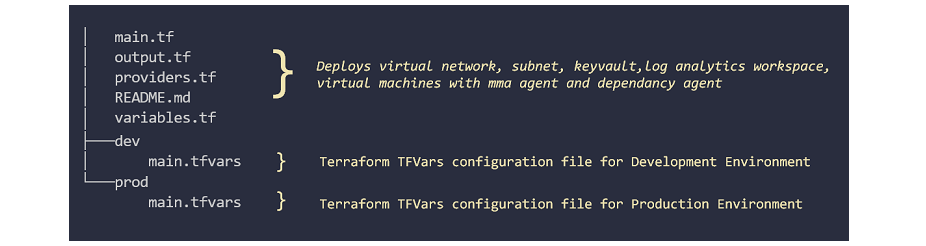

# EP9 - Streamline your Terraform Builds

In this episode, I will show you how deploy multiple Azure environments with the same Terraform code base!

## Prepare your Environment
#### If you are not sure on how to setup your environment, refer to the [EP4: Build an Azure Lab with Terraform - Prepare your Environment](https://www.youtube.com/watch?v=MOaHQFeYI1Q&t=939s)

### Scripts

See [ep4_azure_lab_terraform/scripts](https://github.com/someoneelsescloud/ep4_azure_lab_terraform/tree/master/scripts) for the following scripts to get started:

|Name|Description|
|---|---|
|.\scripts\Clean-Terraform|Clean up Terraform working folders - Terraform init will restore the folder|
|.\scripts\Create-TFServicePrincipal|Create Service Principal for Terraform|
|.\scripts\Install-Terraform|Downloading and configure Terraform open source|
|.\scripts\Uninstall-AzModule|Uninstall the Az Module - Script above requires AzureRM|


## Single-Deploy Terraform Configuration
We will be reusing the [Single Deployment](https://github.com/someoneelsescloud/ep4_azure_lab_terraform/tree/master/lab/single-deploy) code from [EP4: Build an Azure Lab with Terraform](https://github.com/someoneelsescloud/ep4_azure_lab_terraform)

### Key Benefits
- Simplify your deployments.
- Ensure that your environments are consistent.
- Reduce code sprawl by having the same code base.

### Code Structure Summary:


This is a simplified Terraform deployment, where by all the configuration files are within the single folder i.e. a Terraform workspace. However the code has been refactored to use variable inputs which allow you to specify environment and region. The resource names have been updated to include the environment and tag have been added to specify environment specific details.
The following diagram shows all the components that will be deployed!

### Deployment Overview


### Document References:
- [Hashicorp - Terraform: Get Started - Azure](https://learn.hashicorp.com/collections/terraform/azure-get-started)
- [Input Variables](https://www.terraform.io/docs/language/values/variables.html)
- [Local Values](https://www.terraform.io/docs/language/values/locals.html)
- [Define Input Variables](https://learn.hashicorp.com/tutorials/terraform/azure-variables?in=terraform/azure-get-started)
- [Refactor Monolithic Terraform Configuration - Example is AWS but concept is the same!](https://learn.hashicorp.com/tutorials/terraform/organize-configuration)
- [What is the difference between variable.tf and variable.tfvars in Terraform?](https://amazicworld.com/difference-between-variable-tf-and-variable-tfvars-in-terraform/)

### Terraform Commands to Deploy
```
# Working Directory
cd .\ep9_steamline_terraform_builds\dev

# Initialise the Terraform Workspace
terraform init -var-file="main.tfvars" ..\

# Terraform Plan show what resources will be deployed
terraform plan -var-file="main.tfvars" ..\

# Terraform Apply to deploy the environment
terraform apply -var-file="main.tfvars" ..\

# Terraform Destory to delete the environment
terraform destroy -var-file="main.tfvars" ..\
```
#### You can see more information on the commands from [EP4: Build an Azure Lab with Terraform - Terraform Commands](https://www.youtube.com/watch?v=MOaHQFeYI1Q&t=465s).

## Full episode on here:
Website Link: 

### Listen to the Audio Only version:

Google Podcasts: https://cutt.ly/ogvwqTl

Apple Podcasts: https://cutt.ly/YgvweNk

Spotify Podcasts: https://cutt.ly/igvwezs

Stitcher Radio: https://cutt.ly/ugvwewo

Tunein Radio: https://cutt.ly/Xgvwwpf

Visit the website for more information: www.someoneelsescloud.com

See all links to all platforms here: https://www.someoneelsescloud.com/links
